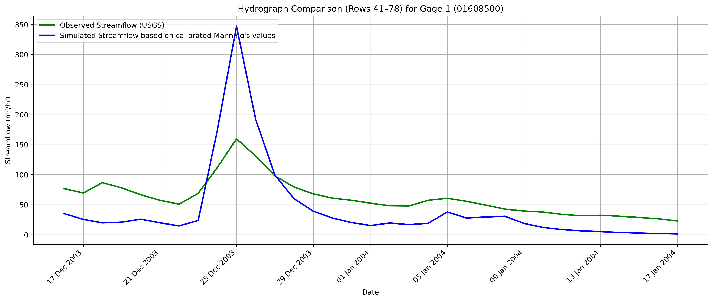
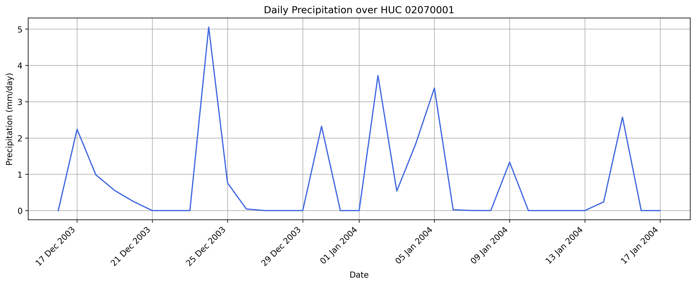

## Calibrating The Manning's values and Hydraulic conductvity 

Plotting the streamflow **with calibrated Manning's values** shows that, while the calibration corrected the timing of peak flows between the USGS-observed and baseline streamflow, **some periods still show magnitude discrepancies**. This indicates a need for further calibration.

The period identified for re-calibration is:

  - Start date: 2003-12-05
  - End date: 2004-01-11

## Hydrograph(Start Date: 2003-12-05 End Date: 2004-01-11)

## Precipitation 

