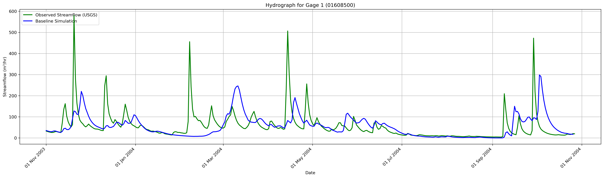
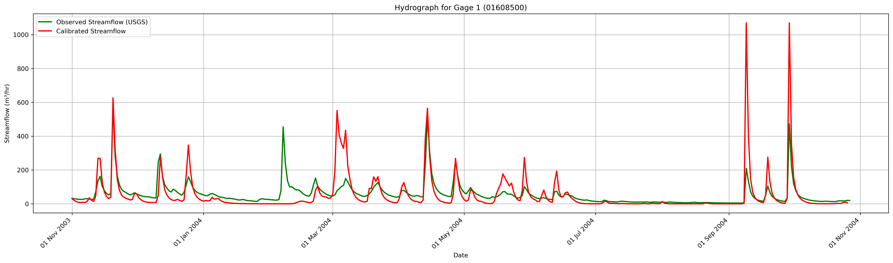

## Description
After training the **SNPE** to match the **simulated streamflow** (from ParFlow) to the **observed streamflow** from USGS in the HUC domain **02070001** (South Potomac River), the next step is to evaluate the generalizability of the **inferred Manning's values**. The **inferred Manning's values**, obtained from the training of the surrogate model between **October, 27, 2003** and **December, 1, 2003**, will be tested on a different period to assess how well the simulated streamflow alings with **USGS** observations on a different period of time. 

It is important to note that the calibration of **Manning's values** us meant to compensate for various source of errors, including the **assumptions of homogenity, the impact of anthropogenic activities, uncertainties in forcing data, and limitations of static input data.** Since the magnitude of these errors may very across different times of the year, validating the trained Manning's values on a different period is essential. This evaluation will help determine wether the same Manning's values remain valid under varying conditions, or of the underlying errors shift in a way that require calibration. 

## Analysis 
From the **hydrograph**, we can observe discrepancies in both timing and peak magnitude between the observed streamflow, and the simulated streamflow. These differences were corrected for the period between **October 27, 2003 and December 1, 2003**.

Therefore, it is important to test the inferred Manning's **on other periods where similar discrepancies were identified**. The selected test periods are:

- **Start date:** 2003-12-05 &nbsp;&nbsp;&nbsp; **End date:** 2004-01-11  
- **Start date:** 2004-02-04 &nbsp;&nbsp;&nbsp; **End date:** 2004-03-04  
- **Start date:** 2004-04-09 &nbsp;&nbsp;&nbsp; **End date:** 2004-05-09  
- **Start date:** 2004-09-01 &nbsp;&nbsp;&nbsp; **End date:** 2004-11-01

## Conclusion 
The **inferred Manning’s values** should be tested across different time periods to evaluate their performance and assess how the calibration may vary over time.

A good starting point is to calculate the **mean** and **standard deviation** of both the **baseline simulated streamflow** and the **observed USGS streamflow** for each testing period. 

By examining how the mean and standard deviation differ between the baseline and observed streamflow in each time window, and comparing those differences to the period used for surrogate training, we can assess the stability of the calibration. If the magnitude of discrepancy is similar, it may indicate that the calibrated Manning’s values are appropriate for other period as well. Significant differences, however, may suggest the need for period-specific recalibration due to difference in input data uncertainty, or other factors.

## Results 

## Hydrograph Plots: 
### Baseline Simulation vs Observed Streamflow

### Calibrated Streamflow vs Observed Streamflow 

## Results 
The **hydrograph** shows that the **calibrated streamflow** aligns well with the observed streamflow, with no noticeable time difference in peaks flows between the observed streamflow and the calibrated streamflow. This suggests that the **calibrated Manning's values** effectively compensate for errors in the put data of the **physically based model**, as reflected by the improved synchronization of peaks timings. 

## Future Work 

**Future work** should focus on correcting the discrepancies in peak magnitude, by incoporating hydraulic conductvity. However, **a sensitivity analysis** is first needed to determine wether peak flows are influenced by variations in **hydraulic conductivity**. 

