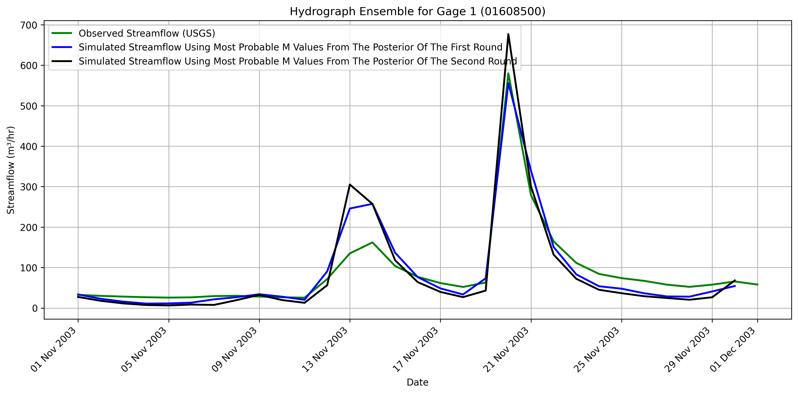

## Description

**A second round of training** was conducted to assess whether model performance could be improved, given that **the first round successfully calibrated the Manning’s values,** resulting in a good match between the **simulated streamflow** and the **observed streamflow from USGS**. The **SNPE model** was trained using the same **100 realizations** as in the first round. 

## Results 
The **hydrograph** shows that **both rounds** were able to match the **simulated streamflow** to the **observed streamflow** from **USGS**.

However, the **first round** yielded a **closer match** to the **observed streamflow** from **USGS**. This suggests that the **initial training** already captured the pattern of the streamflow. 

## Analysis 

In the **first round**, we used a **wide prior** for Manning's values. This allowed the surrogate model **(SNPE)** to explore a broad parameter space, and learn how different **Manning's values** affect the entire streamflow. 

In the **second round**, the prior becomes very narrowed affecting the learning of the **SNPE**. By narrowing the prior too much, the **surrogate model** sees **less variation** in Manning's values. It can no longer learn how small changes affect the overall streamflow, especially peak flows. 

## Conclusion 
If the first round already learned the realtionship well, then it is not necessarily need a second round. The second round may be needed when we start with a **very wide prior** or **the model fails to learn**. Then, a **second round** is needed to **refine uncertainty gradually**. 
